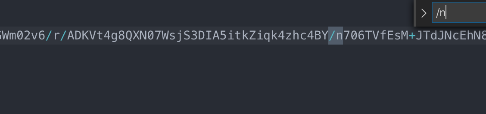

**问题：** 微信小程序下，请求后端返回的图片 buffer，在 ios 下，显示正常，安卓下，显示失败。



**原因：** 在 arraybuffer 转 base64 时，会生成换行符号等问题，安卓下会截断 base64 长度，需进行 replace 替换掉转义符号

```js
http.get(`/h5-api/basic/captcha?${+new Date()}`, {}, {
  responseType: 'arraybuffer'
})
  .then({ data = {} } => {
    if (data.result) {
      const base64Url = wx.arrayBufferToBase64(res.result)
      this.setData({
        // old
        // captchaUrl: 'data:image/png;base64,' + base64Url
        // now
        captchaUrl: 'data:image/png;base64,' + base64Url.replace(/\/r|\/n/g, '')
      })
    }
  })
  .catch(err => console.log(err))
```