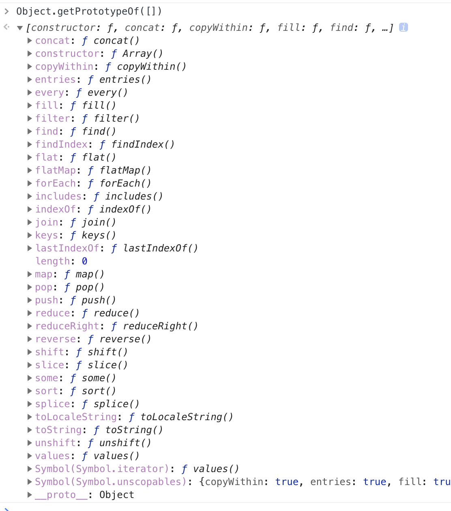

#### Array.* 属性
* length
#### Array.* 方法
* from
* isArray
* of

#### Array.prototype.* 方法

<div style="display:flex;">
  <ul style="flex:1;">
    <li>concat</li>
    <li><i>constructor</i></li>
    <li>copyWithin <code>未用过</code></li>
    <li>entries</li>
    <li>every <code>未用过</code></li>
    <li>fill <code>不了解</code></li>
    <li>filter</li>
    <li>find</li>
    <li>findIndex</li>
    <li>flat <code>【实验阶段】</code></li>
    <li>flatMap <code>【实验阶段】</code></li>
    <li>forEach</li>
    <li>includes</li>
    <li>indexOf</li>
    <li>join</li>
    <li>keys</li>
    <li>lastIndexOf</li>
  </ul>
  <ul style="flex:1;">
    <li><i>length</i></li>
    <li>map</li>
    <li>pop</li>
    <li>push</li>
    <li>reduce</li>
    <li>reduceRight <code>未用过</code></li>
    <li>reverse</li>
    <li>shift</li>
    <li>slice</li>
    <li>some <code>未用过</code></li>
    <li>sort</li>
    <li>splice</li>
    <li>toLocaleString</li>
    <li>toString</li>
    <li>unshift</li>
    <li>values</li>
  </ul>
</div>

<details>
  <summary>pop()</summary>

  * 从数组中删除最后一个元素，并返回该元素的值。<br>
  * 此方法更改数组的长度。

  ```js
  var arr = [1,2,3]
  arr.pop() // 3
  arr // [1, 2]
  ```
</details>


* `map`: 遍历数组，返回回调返回值组成的新数组


* `forEach`: 无法`break`，可以用`try/catch`中`throw new Error`来停止


* `filter`: 过滤


* `some`: 有一项返回`true`，则整体为`true`


* `every`: 有一项返回f`alse`，则整体为`false`


* `join`: 通过指定连接符生成字符串


* `push / pop`: 末尾推入和弹出，改变原数组， 返回推入/弹出项


* `unshift / shift`: 头部推入和弹出，改变原数组，返回操作项


* `sort(fn) / reverse`: 排序与反转，改变原数组


* `concat`: 连接数组，不影响原数组， 浅拷贝


* `slice(start, end)`: 返回截断后的新数组，不改变原数组


* `splice(start, number, value...)`: 返回删除元素组成的数组，value 为插入项，改变原数组


* `indexOf / lastIndexOf(value, fromIndex)`: 查找数组项，返回对应的下标


* `reduce / reduceRight(fn(prev, cur)， defaultPrev)`: 两两执行，prev 为上次化简函数的`return`值，cur 为当前值(从第二项开始)


<hr>
