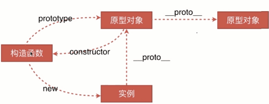

es6 里的class 是个语法糖，根据在编写时，和转码后示例来进行理解语法糖。
例如：
```js
// classes
class Circle extends Shape {
  constructor ( radius ) {
    super();
    this.radius = this;
  }

  area () {
    return Math.PI * Math.pow( this.radius, 2 );
  }
}
```
buble 转换后：
```js
// classes
var Circle = (function (Shape) {
  function Circle ( radius ) {
    Shape.call(this);
    this.radius = this;
  }

  if ( Shape ) Circle.__proto__ = Shape;
  Circle.prototype = Object.create( Shape && Shape.prototype );
  Circle.prototype.constructor = Circle;

  Circle.prototype.area = function area () {
    return Math.PI * Math.pow( this.radius, 2 );
  };

  return Circle;
}(Shape));
```
* 首先是个立即执行函数（IIFE），传入的是 `extend` 内容 `Shape`，
* 在 `IIFE` 里定义 构造函数 `Circle`， 构造函数 `Circle` 接收 cunstructor 构造器时传入的参数 radius，
* `Shape.call(this)` 对 `Shape` 重新绑定 `this`，
* `if (Shape)` 来判断是否存在 `extend`, 并将 `Circle` 的 `__proto__` 指向 `Shape`
* 修改构造函数 `Circle` 的原型为 `Object.create( Shape && Shape.prototype )`，即对原型进行继承
* `Circle.prototype.constructor = Circle` -- 因为修改了原型，需重新 将 `constructor` 指向构造函数 `Circle`
* 在里面定义的方法 `area`，也是绑定在 `Circle.prototype` 原型上的方法。

**总结：**
es6 里 `class` 是语法糖，实现思路大致是定义构造函数 `Circle`，并将构造函数 `Circle` 原型 `prototype` 进行继承修改，当然，在修改(覆盖)原型下，还得重新修改 `__proto__` 和 `constructor` 的指向，然后，在 `class` 里定义的方法也是挂到 构造函数 `Circle` 的 原型 `prototype` 上，在构造函数 `Circle` 里的 this 上添加属性/方法是挂载到实例上，如 `this.radius = this`。

涉及到的知识点也是原型链的知识点为主，附张原型链的图，将上面代码对号入座来加深理解。


[示例代码参考 https://buble.surge.sh](https://buble.surge.sh)