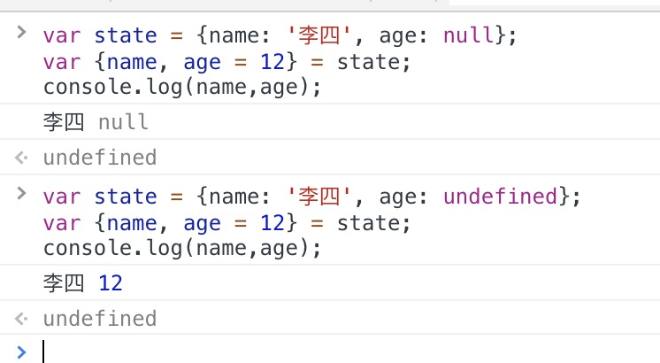

### 默认值
对象的解构也可以指定默认值。
```js
var {x = 3} = {};
x // 3

var {x, y = 5} = {x: 1};
x // 1
y // 5

var {x: y = 3} = {};
y // 3

var {x: y = 3} = {x: 5};
y // 5

var { message: msg = 'Something went wrong' } = {};
msg // "Something went wrong"
```
默认值生效的条件是，对象的属性值严格等于undefined。
```js
var {x = 3} = {x: undefined};
x // 3

var {x = 3} = {x: null};
x // null
```
上面代码中，属性x等于null，因为null与undefined不严格相等，所以是个有效的赋值，导致默认值3不会生效。