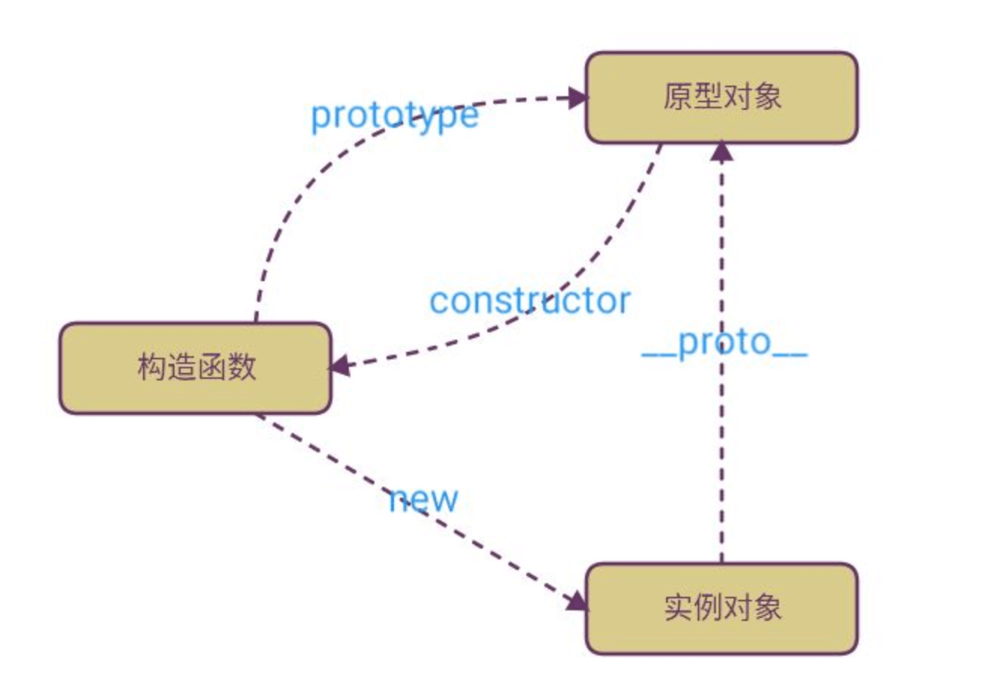

如图所示：


```js
// 构造函数
function Person(name) {
  this.name = name
}
// 重写原先对象
Person.prototype = {
  // 重写原先对象时，将constructor重新指回到 构造函数 Person,
  // 但将constructor 改为了可枚举属性，
  // 可使用Object.defineProperty(Person.prototype, 'constructor', {enumerable: false, value: Person }) 
  // 重新设置枚举为 false
  constructor: Person,
  getName: function () {
    return this.name
  }
}
// or
// Person.prototype.getName = function () {
//   return this.name
// }
const tom = new Person('tom')

const jack = new Person('jack')

console.log(tom.__proto__ === jack.__proto__) // true
console.log(tom.getName()) // 'tom'
console.log(jack.getName()) // 'jack'
console.log(Person.constructor) // ƒ Function() { [native code] }
console.log(tom.constructor === Person) // true
console.log(jack.constructor === Person) // true
```
