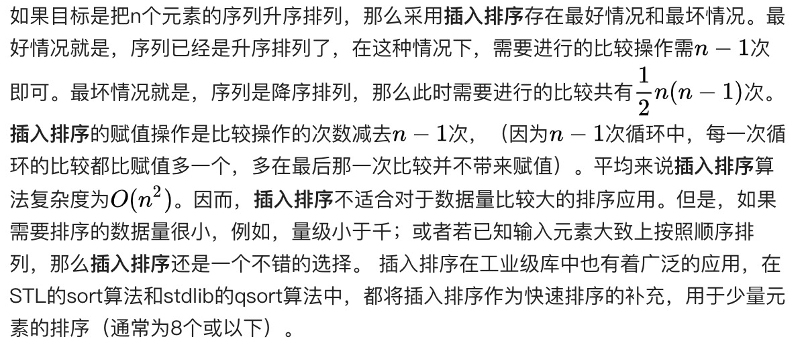

## 插入排序

### 步骤
* 从第一个元素开始，该元素可以认为已经被排序
* 取出下一个元素，在已经排序的元素序列中从后向前扫描
* 如果该元素（已排序）大于新元素，将该元素移到下一位置
* 重复步骤3，直到找到已排序的元素小于或者等于新元素的位置
* 将新元素插入到该位置后
* 重复步骤2~5


### 实现
```js
function sortSmallToBig(arr) {
  console.time();
  for (let i = 1; i < arr.length; i++) {
    // 从已经排序的序列最右边的开始比较，找到比其小的数
    let j = i;
    // 记录要插入的数据
    let temp = arr[i];
    while (j > 0 && temp < arr[j - 1]) {
      arr[j] = arr[j - 1];
      j--;
    }
    // 存在比其小的数，插入
    if (j !== i) {
      arr[j] = temp;
    }
  }
  console.timeEnd();
  return arr;
}
// or
function sortSmallToBig (arr) {
  var i, j;
  for (i = 1; i < arr.length; i++) {
    for (j = 0; j<i; j++) {
      if (arr[j] > arr[i]) {
        arr.splice(j, 0, arr[i]);
        arr.splice(i + 1, 1);
        break;
      }
    }
  }
  return arr;
}
```
### 测试
```js
console.log(sortSmallToBig([2,7,3,1,9,3]));
// default: 0.02490234375ms
// [1, 2, 3, 3, 7, 9]
```
### 算法复杂度
